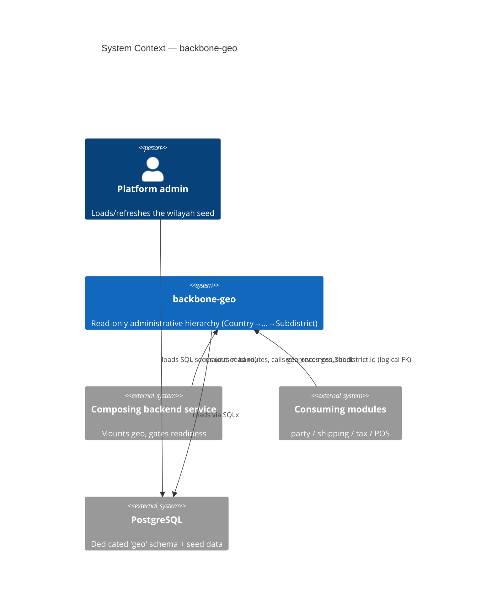
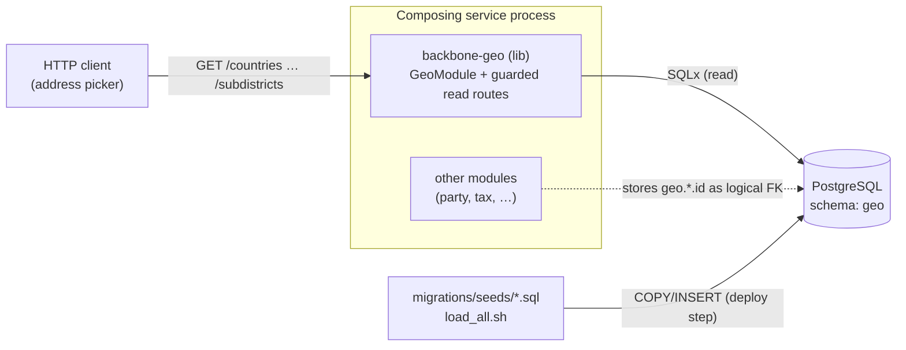
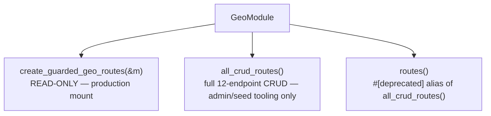
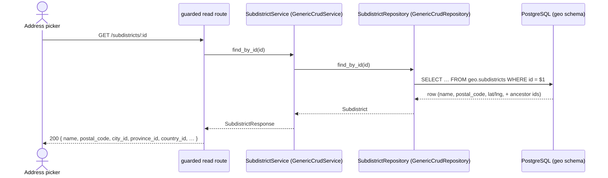
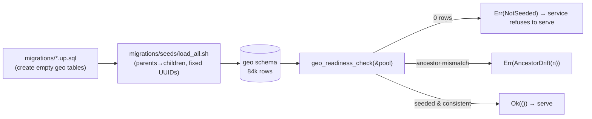

<!-- Reader: Maintainer · Mode: Explanation -->
# Architecture

`backbone-geo` is a **library crate** (no binary) that owns the administrative-geography bounded
context. It is a faithful instance of the Backbone `module` project type: a DDD 4-layer cake whose
outer layers are **generated from schema YAML**, wrapped around a small amount of hand-authored,
regeneration-safe code. This page goes top-down — context, containers, the four layers, then a read
traced end-to-end — so a new maintainer knows where any change belongs before touching a file.

## 1. Context

Geo is a shared reference library consumed by other modules inside a composing backend service. It
has no actors of its own beyond the service that mounts it and the admin who seeds it.



*What to notice: two different arrows reach geo's data. The admin **writes** the seed straight into
Postgres, out-of-band. Consumers only ever **read** — and they reference rows by id, never by a
database foreign key.*

## 2. Containers

Geo does not deploy on its own; it is linked into a composing service's process. The "containers"
are therefore the process that hosts it and the database schema it owns.



*What to notice: geo and its consumers share one process and one database, but geo owns exactly one
schema (`geo`). The seed enters through a separate deploy-time path (`load_all.sh`), not through the
HTTP surface.*

## 3. Components / modules — the DDD 4 layers

The dependency rule points inward: **presentation → application → infrastructure → domain**, and
domain depends on nothing. Everything outside a `// <<< CUSTOM` marker is regenerated from
`schema/models/*.model.yaml`.

| Layer | Path | Holds (for geo) | May depend on |
|-------|------|-----------------|---------------|
| **Domain** | `src/domain/` | `Country`, `Province`, `City`, `District`, `Subdistrict` entities; repository traits (ports) | nothing |
| **Application** | `src/application/` | Service type aliases over `GenericCrudService`; DTOs; **hand-authored `geo_readiness.rs`** | domain |
| **Infrastructure** | `src/infrastructure/` | Repository newtypes over `GenericCrudRepository<_, PgPool>` | domain, application |
| **Presentation** | `src/presentation/` | Generated CRUD handlers; **hand-authored `guarded_routes.rs`** (read-only mount) | application |
| **Composition root** | `src/lib.rs` | `GeoModule` + builder; public re-exports | all of the above |

Each entity is the same vertical slice, five times over. The service is a **type alias**, not a
hand-rolled impl:

```rust
// application/service — one line per entity
pub type SubdistrictService =
    GenericCrudService<Subdistrict, CreateSubdistrictDto, UpdateSubdistrictDto, SubdistrictRepository>;
```

and the repository is a **thin newtype** over the generic:

```rust
// infrastructure/persistence
pub struct SubdistrictRepository(GenericCrudRepository<Subdistrict, PgPool>);
```

The generic machinery (`GenericCrudService`, `GenericCrudRepository`, `BackboneCrudHandler`) comes
from the framework crates; geo supplies types and wiring, not CRUD logic.

### Where geo departs from a generic module

Two files are hand-authored and marked `user_owned` in [`metaphor.codegen.yaml`](../metaphor.codegen.yaml)
so regeneration never touches them:

- **`src/presentation/http/guarded_routes.rs`** — `create_guarded_geo_routes(&GeoModule)` mounts
  only the generated `create_*_read_routes` for all five entities. The write endpoints
  (create/patch/delete/upsert) that `BackboneCrudHandler` generates are simply **not mounted**.
- **`src/application/service/geo_readiness.rs`** — `geo_readiness_check(&pool)` and
  `ancestor_drift_count(&pool)`: the startup/readiness gate described in
  [ADR-002](adr/ADR-002-seed-lifecycle-and-readiness.md).

### The composition root

`GeoModule::builder().with_database(pool).build()?` constructs one repository and one service per
entity and stores them behind `Arc`. It exposes three route surfaces:



*What to notice: the **only** production-appropriate mount is the guarded, read-only one.
`all_crud_routes()` exposes unvalidated generic writes on reference data and exists only for trusted
tooling; `routes()` is a deprecated alias kept to steer naive callers away.*

## 4. Data & control flow — resolve an address (read)

The representative operation: a client resolves a subdistrict to its full ancestor chain (business
flow "Resolve an address to its chain", pinned by golden case **GGC-1**).



*What to notice: no join. Because the subdistrict row **carries its ancestor ids** (denormalized),
resolving "which province is this in?" is a field read, not a four-level join. Filtering
`GET /subdistricts?province_id=…` is likewise a single indexed equality.*

A **write** attempt (`POST /subdistricts`, `DELETE /subdistricts/:id`) against the guarded mount is
never routed — it returns `405/404`, asserted by integrity probe **IGC-2**. That is the
architecture enforcing "reference data, no HTTP writes" at the transport layer.

## 5. The seed & readiness path (out-of-band)

Seed data does not flow through any of the above. It is a **deploy step**:



*What to notice: the readiness gate is what makes seeding non-optional. An empty or partially
re-seeded geo fails the gate, so a composing service can't boot healthy on top of empty reference
data. See [ADR-002](adr/ADR-002-seed-lifecycle-and-readiness.md).*

## Key decisions

- [ADR-001 — the geo reference bounded context](adr/ADR-001-geo-reference-boundary.md): what geo
  owns, read-only over HTTP, denormalized ancestors, dedicated schema, logical FKs, adopt the seed.
- [ADR-002 — seed lifecycle & readiness guard](adr/ADR-002-seed-lifecycle-and-readiness.md): the
  seed is a required, guarded deploy step; empty/drifted geo is a hard failure.

## Canonical vs. shipped layout

The [module README](../README.md) documents the **full** canonical module tree (event store, cache,
gRPC, GraphQL, CLI, workflows, state machines, …). Geo ships only the minimal subset it needs:
`domain/{entity,repositories}`, `application/{dto,service}`, `infrastructure/persistence`,
`presentation/http`, `routes`, `seeders`. The empty optional folders are *slots*, documented so a
maintainer knows where a new layer would go — not a signal that geo should grow one. See
[Technology § Why the stack stays small](technology.md#why-the-stack-stays-small).
